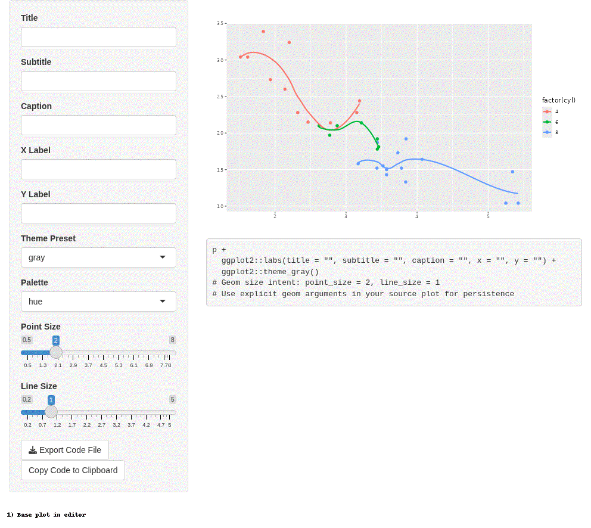

```{r, include = FALSE}
knitr::opts_chunk$set(collapse = TRUE, comment = "#>")
```

This walkthrough demonstrates the redesigned `ggplotStudioR` workflow:

1. build a base plot
2. apply deterministic edit spec steps
3. preview resulting plots
4. export additive and patch code

## Base plot

```{r}
library(ggplot2)
library(ggplotStudioR)

p <- ggplot(mtcars, aes(wt, mpg, colour = factor(cyl))) +
  geom_point() +
  geom_smooth(se = FALSE) +
  labs(colour = "Cylinders")

p
```

## Deterministic demo journey

```{r}
journey_add <- ggplotStudioR:::build_demo_code_journey(
  base_plot_expr = "p",
  plot = p,
  mode = "additive"
)

summary_table <- data.frame(
  step = vapply(journey_add, `[[`, character(1), "step_name"),
  stringsAsFactors = FALSE
)
knitr::kable(summary_table)
```

## Additive export code

```{r, results = 'asis'}
for (step in journey_add) {
  cat("\n### Step ", step$step_number, ": ", step$step_name, "\n\n", sep = "")
  cat("```r\n")
  cat(step$code)
  cat("\n```\n")
}
```

## Patch export code (same final spec)

```{r}
final_spec <- journey_add[[length(journey_add)]]$spec
patch_code <- ggplotStudioR:::generate_plot_code("p", final_spec, mode = "patch")
cat(patch_code)
```

## Edited plots per step

```{r}
edited_plots <- ggplotStudioR:::build_demo_plot_journey(p)
length(edited_plots)
```

```{r}
edited_plots[[5]]
```

## Interactivity in static docs

Vignettes/pkgdown cannot execute live click handlers. Use `launch(p)` locally for full canvas selection + inspector editing.

```{r, echo = FALSE, out.width = '85%', fig.cap = 'Recorded app walkthrough GIF (live interaction shown as recording).'}

```
