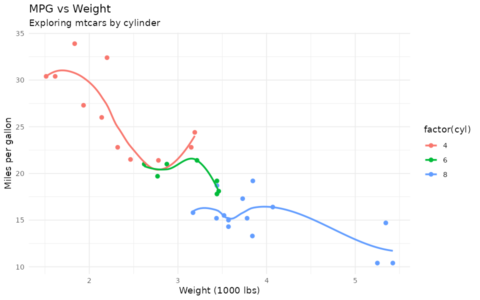

```{r, include = FALSE}
knitr::opts_chunk$set(collapse = TRUE, comment = "#>")
```

This article demonstrates a full editing flow in `ggplotStudioR`: start with a base plot,
apply control updates step by step, and inspect the generated code after each change.

Because pkgdown/vignettes are static, they cannot show live sliders or callbacks. To make
that limit explicit, this article includes static screenshot-style PNGs for selected steps.

## Base plot

```{r}
library(ggplot2)
library(ggplotStudioR)

p <- ggplot(mtcars, aes(wt, mpg, color = factor(cyl))) +
  geom_point() +
  geom_smooth(se = FALSE)

p
```

## Deterministic step sequence

```{r}
journey <- ggplotStudioR:::build_demo_code_journey(base_plot_expr = "p")

summary_table <- data.frame(
  step = vapply(journey, `[[`, character(1), "step_name"),
  stringsAsFactors = FALSE
)

knitr::kable(summary_table)
```

## Generated code after each control change

```{r, results = 'asis'}
for (step in journey) {
  cat("\n### Step ", step$step_number, ": ", step$step_name, "\n\n", sep = "")
  cat("```r\n")
  cat(step$code)
  cat("\n```\n")
}
```

## Static screenshots (interactivity limitation in docs)

These PNGs are static captures for documentation only. In the app, updates happen live as
controls move.

```{r, echo = FALSE, out.width = '80%', fig.cap = 'Base plot (static screenshot).'}
knitr::include_graphics("figures/step-01-base.png")
```

```{r, echo = FALSE, out.width = '80%', fig.cap = 'After label/theme changes (static screenshot).'}

```

```{r, echo = FALSE, out.width = '80%', fig.cap = 'After palette and size updates (static screenshot).'}
knitr::include_graphics("figures/step-03-palette-size.png")
```

## Reproducing the journey in code

```{r}
edited_plots <- ggplotStudioR:::build_demo_plot_journey(p)

length(edited_plots)
class(edited_plots[[1]])
```

You can inspect any step, for example:

```{r}
edited_plots[[5]]
```
